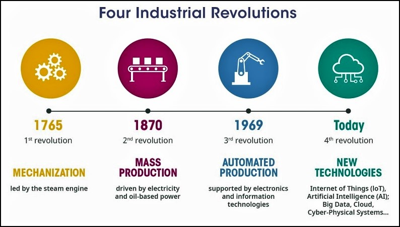
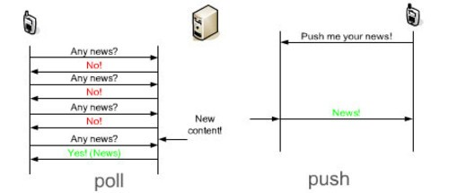
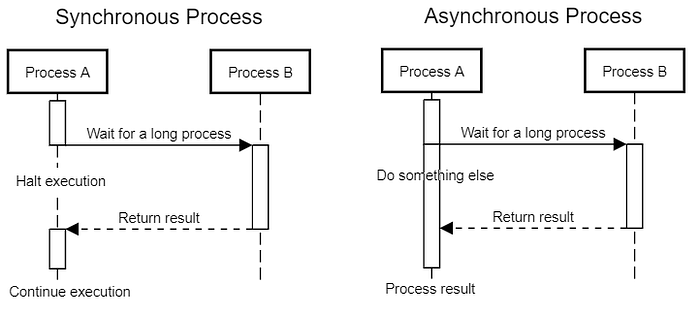
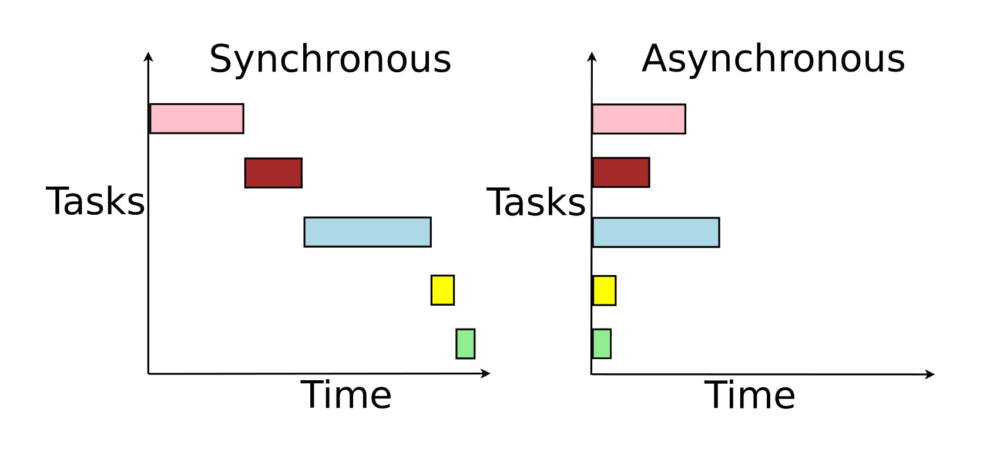

# Module 1 : Introduction

## Overview

This module is an introduction to the basic concepts of reactive programming and RxJs.

---

*Note: The first few sections are conceptual to establish a framework for exactly what we mean in the course when specific terms are used. In addition, providing non-programming examples of these concepts will help develop a more concrete frame of reference that should make understanding the technical concepts easier.*

---

## Statement of the Problem

- There are two basic types of programming problems

#### Non-reactive applications

- These are the traditional top-down application
- Traditionally deterministic
  - We can predict the path of execution given the initial conditions
  - We can map out logic and data flows
- Traditional programming languages evolved to solve these kinds of problems
  - Automation was driven by the need to automate processes

#### Reactive applications

- These are often expressed by the idea of _inversion of control_
- The application has to respond to events that occur in the environment
- What the application does is not directed by a flow of top-down logic
- It is dictated by what events the application has to react to

#### Example - Hospital

- Hospitals have operating rooms which are non-reactive
- Specific operations are scheduled and executed in a top-down deterministic manner

- Hospitals also have emergency rooms which are reactive
- ERs respond to the people that show up in the ER
- What happens is completely non-deterministic
- An ER requires a different model for the application of resources and management than does a more traditional operating room

- We often find that we need a combination of reactive and non-reactive strategies

---

## Why Reactive Programming?

- Simply, the nature of the computing landscape has evolved
- Commonly expressed in terms of the 4th industrial revolution

- Until the rise of cyber-physical systems most applications automated existing processes
- Human-cyber systems were still essentially non-reactive
- Most of the reactive problems have non-reactive solutions
  - These can be cumbersome and complex
  - Eg. Maintaining state during web transactions

- With devices generating massive amounts of event data
- It resulted in what is called "Big Data"
- A number of new tools and techniques to manage streams of data
  - Kafka, Spark, etc

- Eventually, we find that the traditional solutions do not scale well to solve highly reactive solutions

---

## Reactive Applications

- Modern systems tend to be reactive in nature
  - Respond to requests from clients
  - These requests take the form of event streams
  - They also have to be scalable and resilient
  - Eg. Netflix, Uber and other large applications

---

## The Reactive Manifesto

Located at [The Reactive Manifesto](https://www.reactivemanifesto.org/) and as a pdf in the student repository.

---

## The Reactivex Library

[ReactiveX](https://reactivex.io/)

---

## Programming Paradigms

- A programming paradigm is a set of:
  - Assumptions about what the components of a program should be
  - Techniques and principles for building programs
  - Assumptions about what sort of problems are solved best by that paradigm

- According to Kuhn
  - _The entire constellation of beliefs, values, techniques and so on shared by the members of a given community. It also denotes one sort of element in that constellation, the concrete puzzle-solutions which, employed as models or examples, can replace explicit rules as a basis for the solution of the remaining puzzles of normal science._
  

- There are multiple programming paradigms
    - Most have been around since the start of high-level programming in the 1960s
    - A paradigm becomes “main-stream” and supported in programming languages when a set of problems arise that the paradigm is better suited to solve than the other paradigms in use

- The main-stream paradigms in use today:
  - Structured or procedural programming 
  - Object-Oriented Programming
  - Functional Programming

- By analogy, you can think of a programming paradigm as being like a type of cuisine
  - French cooking, Indian cooking, Tex Mex, Barbecue, Mediterranean, etc.

- The focus of a programming paradigm is on how the code is designed and structured, not on how it us used in an execution environment.

---

### Programming Styles

- This is a distinction that tends to be more about how we write code
  

- Imperative code: 
  - Code is a series of instructions that specify how a program execution is to be done
  - Intended to be easily compiled into assembly code
  - Procedural and OO programming tend use the imperative style

  
- Declarative code:
  - Code is a description of what a final result should be
  - Described as a series of transformation
  - The transformations are turned into executable code by the language
  - Requires a layer of abstraction to hide the imperative code
  - Functional and symbolic programming tend to use the declarative style

- Example
  - Cooking at home is imperative because you have to execute each step of preparing a meal yourself
  - Ordering in a restaurant is declarative because you just specify what the end result (i.e. the meal) should be
    - The imperative steps are done in the kitchen
    - Think of the cook as being a _meal API_

---

## Operational Environments

- There are two general types of what we might call _operational environments_
- To follow the cooking example, this would correspond to the kind of restaurant that we might be cooking in
  - This is independent of the cuisine
  - Fast-food, formal dining, take out, buffet... and so on
  

- Restaurants are _reactive_
  - They have to react to events in the form of customer orders
  - Nothing is done until an event occurs

- Cooking at home is _non-reactive_
  - Your family will eat what you cook and when it is ready
  - We can generally ignore requests

---

## Pull and Push

- The terms _pull_ and _push_ are also used to describe reactive and non-reactive environments
- But these terms tend to refer more specifically to how requests go from a client to a program

- In the pull model, the server pulls the data from a client by making a request
  - Polling is a common sort of pull construct
  - The server sends a request for updates to a client at regular intervals
  - Like a server in a restaurant checkin on diners are regular intervals

- In the push mode, the server listens or watches for client events
  - The server then responds to the events
  - Events are often queued up and processed asynchronously 
  - Like the servers in a restaurant passing orders to the cook
  - The cooks do not keep asking the servers if there are any orders

- The push model implicitly requires the following logical components
  - Something that generates events (referred to as the subject)
  - Something that listens or watches for events (referred to as an observer)
  - Some mechanism to decide what to do with the events when they are observed 

---

## Synchronous and Asynchronous Requests

- Synchronous requests occur when the source of the request waits until it gets a response
  - Characteristic of a pull mechanism
  - The source of the request is known so the response can be routed right to them

- Asynchronous requests happen when the source of the request does not wait for a reply
  - This is characteristic of the push model where the system is dealing with events which may or may not be actual requests
  - For example, a server notices the event of a customer trying to sneak out without paying - this is an event, not a request

- Asynchronous systems are much more complicated because we may have to return some sort of value or do something as a result of the request
  - This is often expressed by using callbacks, promises and event listeners
  - The problem is that these systems can get very complicated quickly as the number of events increases
  - We have to coordinate and update tasks in response to incoming events
  - The events have to be delegated to handlers
  - We have to also track what responses are required
  - And how to route those responses
  - We may have many different events coming in from many different sources

- Asynchronous systems also tend to have a lot of concurrent activity
- In synchronous system, a sender must wait for a request before sending another
- In asynchronous systems, there are no such constraints

---

## Functional Programming

- This is not a functional programming course
- But several ideas will be important in the material that follows

1. In functional programming, be basic program components are functions

2. Functions are pure
   - They have no side effects
   - They do not modify their inputs
  
3. Functions are first class
   - Functions are just data
   - They can be assigned to variables
   - They can be passed as arguments to other functions
   - They can be returned by other functions

4. Functions are chained together to create applications

[Functional Programming Basics](https://github.com/readme/guides/functional-programming-basics)

---

## Data Streams

- Common way of managing streams of data in functional programming
- A stream is an immutable data structure
- There is a creation operator that creates a stream from a data source
- There are transformations that create a new stream from an existing stream
- There are terminal operators that convert the stream to a collection or final result
- Functional programming is the most effective way to process data streams

---

## Iterator Design Pattern

- An interface that allows us to get the next element in a collection without having to know how the elements are organized
- The iterator has the internal logic to get the "next" element
- The iterator can determine if there is a next element

---

## Observer Design Pattern

- Allows observers to subscribe to a subject
- Observers are notified of changes to the subject

---

## RxJs

- RxJS is a JavaScript implementation of the ReactiveX Library
- The Angular framework incorporates RxJS

[Angular and RxJS](https://angular.io/guide/rx-library)

---

## Lab 1

---

## End