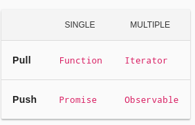

# Core Concepts of RxJS

### Module Two

---

## Basic Concepts

[RxJS Overview](https://rxjs.dev/guide/overview)

The RxJS library is built around a small set of basic concepts

1. **Observable:** An invokable collection of future values or events
2. **Observer:** A collection of callbacks that knows how to listen to values delivered by the Observable.
3. **Subscription:** The execution of an Observable, primarily useful for cancelling the execution.
4. **Operators:** Pure functions that enable a functional programming style of dealing with collections with operations like map, filter, concat, reduce, etc.
5. **Subject:** Equivalent to an EventEmitter, and the only way of multicasting a value or event to multiple Observers.
6. **Schedulers:** Centralized dispatchers to control concurrency, allowing us to coordinate when computation happens on e.g. setTimeout or requestAnimationFrame or others.

---

## Observable

Observables are defined as _"lazy Push collections of multiple values"_



An observable can be thought of as a collection of data that can be sent to observers as a stream of events

Rather than the stream pulling the data from the source, the observable pushes each event onto the stream going to a particular observer by using its `next()` method

The standard iterator pattern is a pull model where the client pulls the next value from the collection.

An observable is a push implementation of the iterator pattern.

##### Using Observables

1. An observable is defined
2. A subscription function is injected that is executed when an observer subscribes
3. When an event occurs, the observable "publishes" the event by calling the `next()` function on the observer
4. When the event stream is completed, the observable notifies the observers in calling the `complete()` function on the observer

```typescript
import { Observable } from 'rxjs';

const observable = new Observable((subscriber) => {
  subscriber.next(1);
  subscriber.next(2);
  subscriber.next(3);
  setTimeout(() => {
    subscriber.next(4);
    subscriber.complete();
  }, 1000);
});
```
--- 

## Observer

An observer is defined as _"a consumer of values delivered by an Observable"_

Structurally, an observer is just an object with three callbacks; one for each type of push an observable will execute.

```typescript
const observer = {
  next: x => console.log('Observer got a next value: ' + x),
  error: err => console.error('Observer got an error: ' + err),
  complete: () => console.log('Observer got a complete notification'),
};
```
If any of the callbacks are not implemented, then the invocation of that callback by the observable will be ignored for that observer.

```typescript
const observer = {
  next: x => console.log('Observer got a next value: ' + x),
  error: err => console.error('Observer got an error: ' + err),
};
```

In its simplest form, a lambda function may be provided in the `subscribe()` operation which acts as an observer where the function is taken to be the `next()` callback.

```typescript
observable.subscribe(x => console.log('Observer got a next value: ' + x));
```

---


## Subscription

When an observer subscribes to an observable, a Subscription object is created to represent the execution context for function executed when an observer subscribes.

The only method that a subscription object has is an `unsubscribe()` method which disposes of the relationship.

When the `subscribe()` method is called, it creates a channel for communication along with any resources that need to be created, for example, event listeners.

Because an observable represents a data source, subscribing starts the flow of data to the observer.

Unsubscribing cleans up the resources created during the execution of the subscription function and stops the flow of data.

```typescript
const observable = of(1, 2, 3); // Observable that emits 1, 2, 3
const subscription = observable.subscribe(
  value => console.log(value), // Called with each emitted value
  error => console.error(error), // Called if there's an error
  () => console.log('Complete') // Called when the stream completes
);

subscription.unsubscribe();
```

When multiple observers subscribe to a single observable, each observer has its own subscription execution context.

---

## Lifecycle of an Observable

The main events for an observable are:

1. Creating the observable
2. Subscribing to an observable
3. Executing the observable
4. Disposing of the observable

---

## Creating Observables

### Using a constructor

The constructor takes one argument which is the function to execute when an observer subscribes.

```typescript
import { Observable } from 'rxjs';

const observable = new Observable(function subscribe(subscriber) {
  const id = setInterval(() => {
    subscriber.next('hi');
  }, 1000);
});

observable.subscribe((x)=> console.log(x))
```

### Creating from Collections

- An observable is a push iterator over a collection, but the example above is not a collection.
- To create an observable from a collection, there are a number of creation functions
- Each of these has an implicit subscribe function which iterates over the collection


### 'of' Operator

- This provides a list of items to iterate over passed as arguments

```typescript
import { of } from 'rxjs';

const ob$ = of ("Goodbye", "Cruel", "World")

ob$.subscribe(value => console.log(value));
```

### 'from' Operator

- Similar to `of`but turns a collection into an observable.

```typescript
import { from } from 'rxjs';

let cheeses = ["Brie", "Gouda", "Tilsit", "Cheddar"];

const ob$ = from(cheeses);

ob$.subscribe(value => console.log(value));
```

### `Interval` Operator

- Creates an Observable that emits sequential numbers every specified interval of time.

```typescript
import { interval } from 'rxjs';

const interval$ = interval(1000); // Emits values every second
interval$.subscribe(value => console.log(value));
```

### `Timer` Operator

- Creates an Observable that starts emitting after an initial delay and then emits sequential numbers optionally

```typescript
import { timer } from 'rxjs';

const ob1$ = timer(2000); // Emits after 2 seconds
ob1$.subscribe(value => console.log(value));

// Emits after 2 seconds, then every second
const ob2$ = timer(2000, 1000);
ob2$.subscribe(value => console.log(value));
```

### `merge`, `concat` and `combineLatest`

- These operators combine the output of two observables in different ways
- `concat` creates an observable that emits values sequentially from multiple observables, one after the other

```typescript
import { concat, of } from 'rxjs';

const obs1$ = of(1, 2, 3);
const obs2$ = of('a', 'b', 'c');
const con$ = concat(obs1$, obs2$);
con$.subscribe(value => console.log(value));
```

- `merge` creates an observable that merges multiple observables into one by emitting all of their values.

```typescript
import { merge, interval } from 'rxjs';

const obs1$ = interval(1000); 
const obs2$ =interval(1000); 

const m$ = merge(obs1$, obs2$);
m$.subscribe(value => console.log(value));

```

- `combineLatest` combines multiple observables to create an observable whose values are calculated from the latest values of each of its input observables.

```typescript
import { combineLatest, of } from 'rxjs';

const obs1$ = of(1, 2, 3);
const obs2$ = of('a', 'b', 'c');
const latest$ = combineLatest([obs1$, obs2$]);
latest$.subscribe(([value1, value2]) => {
  console.log(value1, value2);
});
```

## `fromEvent` Operator

- The data stream can be bounded, like in the `from` and `of` examples
- But it can be unbounded like in the `interval` and `timer` examples
- The `fromEvent` creates an observable from DOM events, which is inherently unbounded
- Creating an observable for a button press will is one of the labs

```typescript
import { fromEvent } from 'rxjs';

const clicks$ = fromEvent(document, 'click');
clicks$.subscribe(event => console.log(event));
```

---

## Subscribing to Observables

- An observable is "executed" by executing the `subscribe()` method
- Think of subscribing as making a function call to an observable that provides three callback methods
    - Once the `complete()` or `error()` callbacks execute, there is no further execution of the next method

```typescript

import { Observable } from 'rxjs';

const observable = new Observable(function subscribe(subscriber) {
  subscriber.next(1);
  subscriber.next(2);
  subscriber.next(3);
  subscriber.complete();
  subscriber.next(4); // Is not delivered because it would violate the contract
});
```

---

## Unsubscribing

- In some cases, the execution environment encapsulated by the subscription may continue indefinitely, such as in the case of an event observable or an interval.
- One of the purposes of the `unsubscribe()` method is to terminate the execution of the `subscribe()` method.

```typescript
import { interval } from 'rxjs';

const ob$ = interval(1000); // Emits values every second
const s = ob$.subscribe(value => console.log(value));

setTimeout(() =>s.unsubscribe(), 5000);
```

- Each observable must define how to dispose resources of it created
- This is done by  by returning a custom unsubscribe function from within function subscribe().

```typescript
//For instance, this is how we clear an interval execution set with setInterval:

import { Observable } from 'rxjs';

const observable = new Observable(function subscribe(subscriber) {
  // Keep track of the interval resource
  const intervalId = setInterval(() => {
    subscriber.next('hi');
  }, 1000);

  // Provide a way of canceling and disposing the interval resource
  return function unsubscribe() {
    clearInterval(intervalId);
  };
});

```

---

## END 
